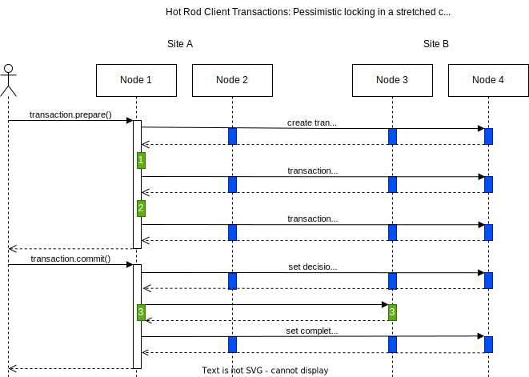

= Hot Rod Client Transaction in a stretched cluster

== Assumptions

* A stretched cluster between 2 regions.
* The server-side cache is configured with pessimistic locking.
* The client transaction only writes to a single key.

== Sequence diagram

== Description

Supporting client transactions is a complex topic.
Many synchronization is required to keep the data consistent.
In a diagram above, the blue boxes represent the processing required outside the user cache and in green,
the user cache interaction.

The servers are only aware of the transaction at commit time.
During the transaction execution, the client keeps tracks of all read or written keys and its versions.
The transaction is committed using the two phase commit protocol, as specified by JakartaEE.

=== Transaction Prepare

The client sends the transaction and all necessary information (versions) for one of the server.
By default, it uses the chooses the primary owner of the first key written (in the diagram, `Node 1`).

When `Node 1` receives the transaction, it creates an internal transaction with the same `XID`.
The transaction is broadcast to all the nodes, and includes the lock ownership, so all nodes who acquired a lock.
This is step `(a)` and it is required if `Node 1` crashes before replying to the client.

Then, `Node 1` replays the transaction, validates if the version read is still valid and acquires the lock (pessimistic locking), step `(1)`.
After the replay, `Node 1` broadcasts that the transaction is valid, step `(b)`.

It prepares the internal transaction too in step `(2)`.
The response to the client is then broadcast, in step `(c)` before sending it back to the client.

At this point, the prepare phase is completed.
If `Node 1` or the client crash, the remaining nodes have enough information to make a decision, by default to abort after a timeout.

=== Transaction Commit

The `TransactionManager` running in the client then decides the transaction outcome, based on all the participants in the transaction.
In the diagram, we assume a commit.

Once again, the client sends the request to the node who prepared the transaction.
Upon receive the commit request, `Node 1` broadcast the decision and, step `(d)`, after all acknowledge, it starts commiting and modifies the user case, step `(3)`.
Step `(d)` keeps the transaction safe if both the client and `Node 1` crash before any change is made into the cache.

The completion message is broadcast to all the nodes in the cluster, step `(e)`, that signals that no more work can be done in that transaction.
`Node 1` replies to the client.

=== Transaction Forget

Not represented in the diagram, the client sends an asynchronous `forget` message to `Node 1`.
`Node 1` broadcasts this message and releases any locks acquired by the transaction.

